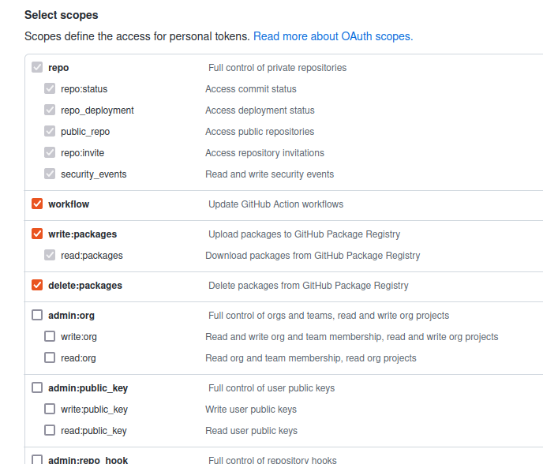

# Step-by-step instructions to recreate the setup

## create github personal token with the next permissions; and export "GITHUB_TOKEN" and "GITHUB_USER" as env variables :

   - 


## fork both repos to your account :
### repo 1 (app + CI) : "git@github.com:hpc-student/http_server.git" :
- this includes the ruby-simple-server application
- Dockerfile 
- Github Actions workflow listen to push events > build new image and push it to registry
- as registry we are using GitHub Container Registry
- once you fork the repo the workflow will be trigered and a new image will be built and pushed to your github container registry "ghcr" ,to check it go to: your profile > packages 

### repo 2 ( CD with FluxV2 - GitOps ): "git@github.com:hpc-student/gitops-demo.git"
- this includes the main work
## we assume you have kubectl configured with your k8s cluster , in case of minikube enable "metallb","metrics-server" addons.
- "metrics-server" required for "Horizontal Pod Autoscaler"
- MetalLB is a load-balancer implementation for bare metal Kubernetes clusters, using standard routing protocols.
## install flux V2 CLI
```
 > curl -s https://fluxcd.io/install.sh | sudo bash
 > #check that you have everything
 > flux check --pre
```
## bootstrap everything with :

```
> flux bootstrap github \
  --components-extra=image-reflector-controller,image-automation-controller \
  --owner=$GITHUB_USER \
  --repository=gitops-demo \
  --branch=main \
  --path=./clusters/dev-cluster \
  --read-write-key \
  --personal
```

<hr>
<hr>
<hr>

# Instructions on how to connect to the running application :

- execute :

` > kubectl get svc -n traefik `

- use the EXTERNAL-IP address , http is forced to https

<hr>
<hr>
<hr>


# the Strategy/Architecture:
## we will use GitOps workflow with flux v2
   >>>  

## CI

check the applictaion repo : https://github.com/hpc-student/http_server.git

it includes Dockerfile and  github actions workflow

when you push code to the main branch the workflow will build a new image and push it to "github container registry" and that's all for the CI

it doesn't need to triger the CD 

> if you like to keep k8s manifests with its application you can do that and then reference the app repo here but that's not what we are going to do
>
> since our developers never work on the infrastructure or the delivery of the application it is easier for Ops to centralize configurations in one repo and this what we are going to do


## CD

- we will be using IaC
this repo will be the "single source of truth" it will be a mirror to what is going on our k8s clusters 

- we will insatll apps and controllers by pushing yaml files to this repo and Flux will sync the modifications to the cluster

- Flux will also listen to our container registry "github container registry" and will update the applictaion when there is a new image , Flux will commit changes to this repo before applying it on the cluster this way this repo will always be in sync with the cluster 

- we will use kustomization to set dependency between Custom Resources and Custom Resource Definition like in traefik , traefik helmRelease must be created before trying to create an IngressRoute

- we can add multiple clusters and we can use kustomization to manage common parts across clusters

- so even if you don't have access with kubectl you must be able to track modifications "like wich version of the app is running" just by checking this repo

### steps 
- setting the basic CI for the applications 
- using tags to track docker image versions
- setting basic CD by installing Flux
- create k8s manifests for the application : deployment - service ... etc
- configure probes: there is no need for startupProbe since the app isn't very big and doesn't include a long bootstrap process so it is enough to increase "initialDelaySeconds" in livenessProbe
- install traefik
- configure traefik
- modify the application "http-server" : add respone code 200 
- setting Image Update Automation for the CI/CD pipeline to be complete
- redirect http to https
- add Pod anti-affinity rule to avoid placing multiple app=http-server servers on a single node
- configure "Horizontal Pod Autoscaler" , note : node autoscaler is related to "amazon auto scaling groups" which is a node pool where you can bootstrap a new node and add to your working plan , I don't know if there is a way to simulate that in minikube
- routing and LoadBalancing : since we have just one app all traffic will be routed to it , ohterwise we can use IngressRoute to route traffic based on paths or subdomains in Ingressroute 
- LoadBalancing: keep the default which is "Round Robin" , we can use IngressRoute to specify another strategy like : "WeightedLeastRequest"