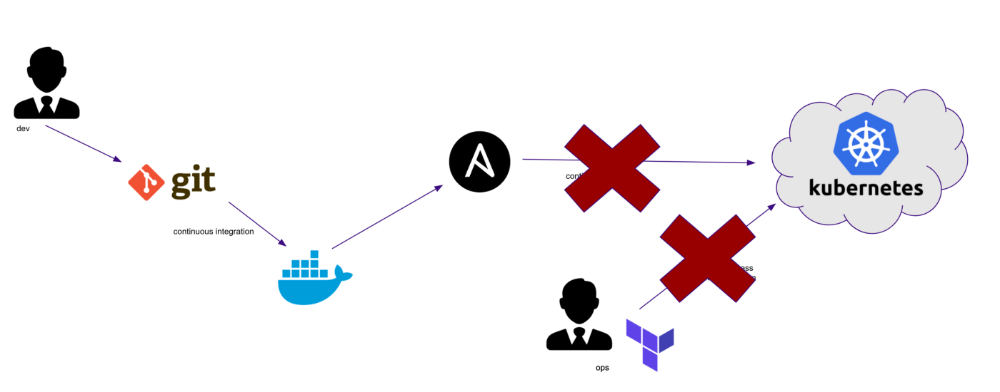

# the Strategy/Architecture
## we will use GitOps workflow with flux v2
   >>>  

## CI

check the applictaion repo : https://github.com/hpc-student/http_server.git

it includes Dockerfile and  github actions workflow

when you push code to the main branch the workflow will build a new image and push it to "github container registry" and that's all for the CI

it doesn't need to triger the CD 

> if you like to keep k8s manifests with its application you can do that and then reference the app repo here but that's not what we are going to do
>
> since our developers never work on the infrastructure or the delivery of the application it is easier for Ops to centralize configurations in one repo and this what we are going to do

## CD

we will be using IaC
this repo will be the "single source of truth" it will be a mirror to what is going on our k8s clusters 

we will insatll apps and controllers by pushing yaml files to this repo and Flux will sync the modifications to the cluster

Flux will also listen to our container registry "github container registry" and will update the applictaion when there is a new image , Flux will commit changes to this repo before applying it on the cluster this way this repo will always be in sync with the cluster 

so even if you don't have access with kubectl you must be able to track modifications "like wich version of the app is running" just by checking this repo

### steps 
- setting the basic CI for the applications 
- using tags to track image versions

- setting basic CD by installing Flux
- create k8s manifests for the application : deployment - service ... etc
- setting Image Update Automation
- install traefic
- configure traefic 
